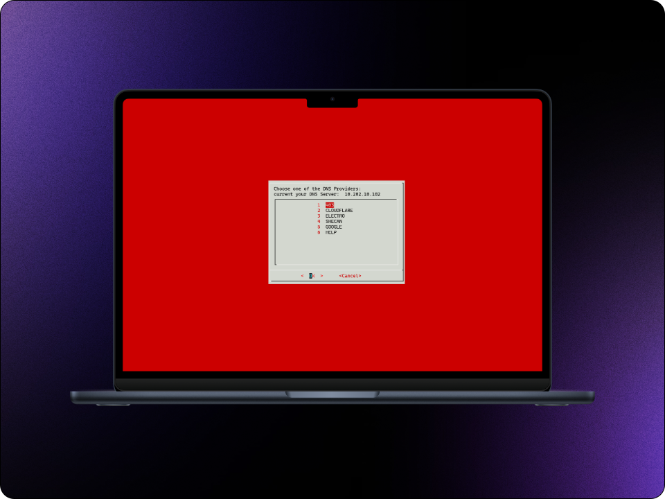

<!-- PROJECT LOGO -->
<br />
<div align="center">
  <a href="https://github.com/mohamadrzm/FilmFlow">
    
  </a>

  <h3 align="center">DNS Pure | دی ان اس پیور</h3>

  <p align="center">
    تغییر دی ان اس راحت تر از همیشه :)
    <br />
    <br />
    <br />
    <br />
    <br />
    <a href="https://github.com/mohamadrzm/dnspure/issues/new?labels=bug">گزارش باگ</a>
    ·
    <a href="https://github.com/mohamadrzm/dnspure/issues/new?labels=enhancement">پیشنهاد قابلیت جدید</a>
  </p>
</div>


## درباره DNS Pure | دی ان اس پیور
با DNSPure میتونید به راحتی DNS سیستمتون رو تغییر بدید. با BASH نوشته شده. سریعه و کار باهاش آسونه. و DNS Provider های مختلفی رو برای کاربرد های مختلف همراه با راهنمایی های استفاده در اختیارتون میذاره  :)

<a href="https://github.com/mohamadrzm/FilmFlow">
    
</a>


<!-- GETTING STARTED -->
## چطوری باهاش DNS سیستممون رو تغییر بدیم؟

با دستور زیر میتونید به سریع ترین شکل DNS سیستمتون رو تغییر بدید : 
   ```sh
   wget https://raw.githubusercontent.com/mohamadrzm/dnspure/main/dnspure.sh && sudo sh dnspure.sh <DNS Provider> <dns change mode : p or t>
   ```
> [!TIP]
> فقط کافیه به جای <DNS Provider> نام DNSی که میخواید رو قرار بدید. برای مثال Cloudflare یا Google و اگه میخواید وقتی سیستمتون رو ری استارت کردید DNSی که تنظیم کردید همچنان باقی بمونه، میتونید به جای <dns change mode : p or t> حرف P  رو قرار بدید و اگه میخواید موقتی باشه و بعد از ری استارت سیستمتون DNSی که تنظیم کردید به قبلی برگرده میتونید از T استفاده کنید برای مثال من میخوام Google DNS رو تنظیم کنم به صورت دائمی به این شکل دستور رو در ترمینال قرار میدم : 

   ```sh
   wget https://raw.githubusercontent.com/mohamadrzm/dnspure/main/dnspure.sh && sudo sh dnspure.sh google p
   ```

لیست DNS Provider ها :

`Shecan` , `Electro` , `403` , `Google` , `Cloudflare`

> [!TIP]
> همچنین اگه با منو و گرافیکی راحت تر هستید میتونید از دستور زیر استفاده کنید :

   ```sh
   wget https://raw.githubusercontent.com/mohamadrzm/dnspure/main/DNSPure.sh && sudo sh DNSPure.sh menu
   ```


> [!NOTE]  
> بعد از اجرا و تغییر DNS اسکریپت روی سیستم نصب میشه و برای تغییر DNS دیگه نیازی نیست مراحل بالا رو تکرار کنید. کافیه dnspure رو به صورت تمامی حروف کوچیک بنویسید تو ترمینال و DNSتون رو تعییر بدید :

مثال : برای تغییر سریع DNS به گوگل : dnspure google t

مثال : برای تغییر DNS با منوی گرافیکی : dnspure menu
<!-- CONTRIBUTING -->
## مشارکت

باعث خوشحالیه اگه با هم پروژه رو ببریم جلو :)


1. پروژه رو فورک کنید
2. یک برانچ جدید بسازید (`git checkout -b dev/AmazingFeature`)
3. تغییرات خودتون رو کامیت کنید (`git commit -m 'Add some AmazingFeature'`)
4. برانچتون رو پوش کنید (`git push origin dev/AmazingFeature`)
5. پول ریکوئست بزنید. تمام :)  

<p align="center">(<a href="#readme-top">برو بالا</a>)</p>


